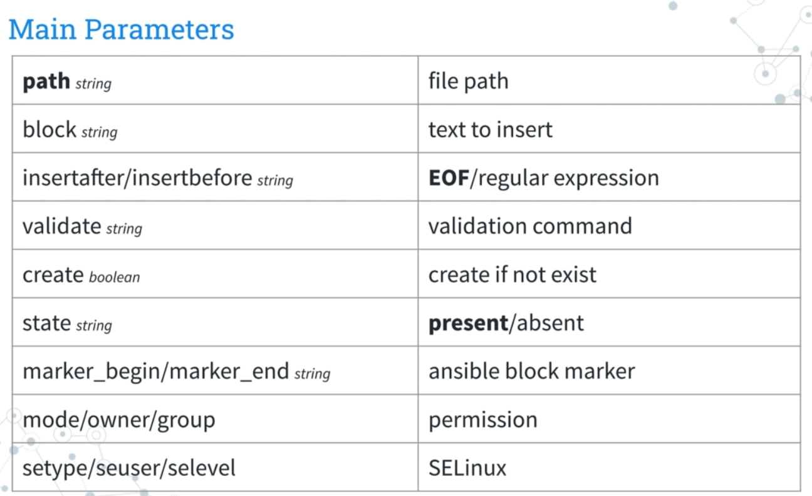

## blockinfile

insert/update/remove a block of multi-line text

## git

Manage git checkouts of repositories to deploy files or software.

## reboot

## ping

## fetch

This module works like ansible.builtin.copy, but in reverse.

It is used for fetching files from remote machines and storing them locally in a file tree, organized by hostname.

The ****flat** parameter in Ansible's ansible.builtin.fetch module determines how the fetched file(s) are stored on the destination host.

### copy
backup : Create a backup file including the timestamp information
validate
checksum
mode/owner