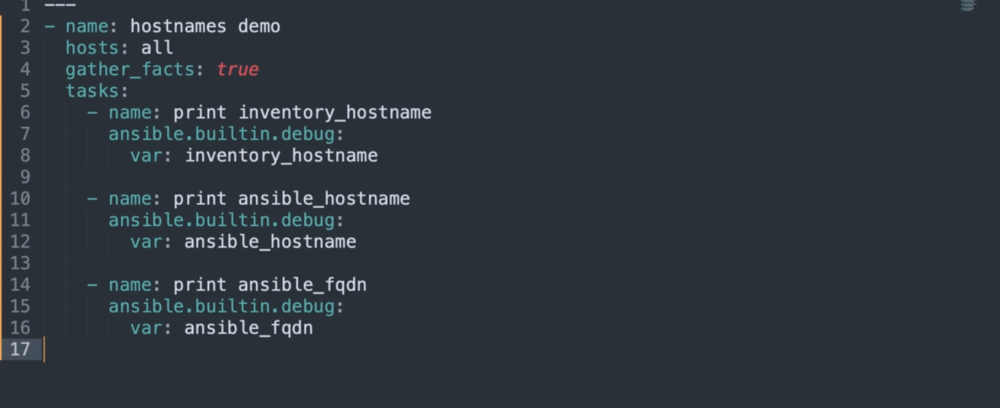
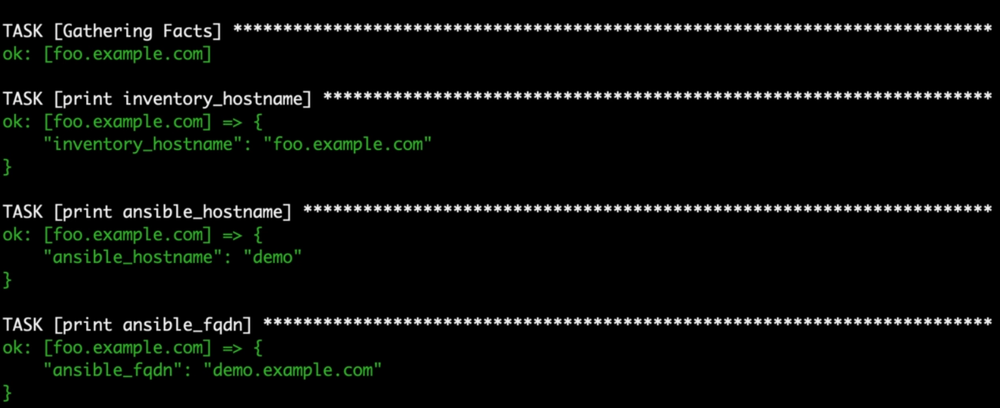
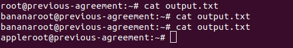
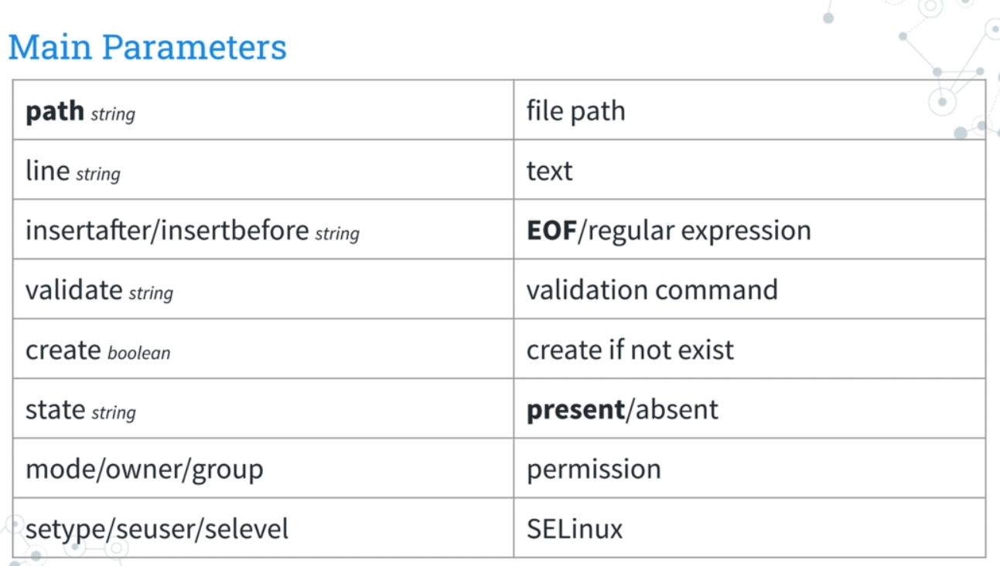
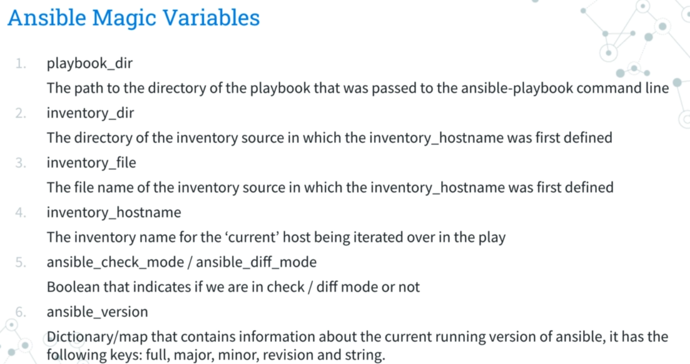

# ansible

ansible modules, best practices and useful commands

## install-ansible-universe

install.sh

```bash
#!/bin/bash
sudo apt update
sudo apt install ansible
```

install-ansible-ppa.sh

```bash
#!/bin/bash
sudo apt update
sudo apt install software-properties-common
sudo add-apt-repository --yes --update ppa:ansible/ansible
sudo apt remove ansible
sudo apt install ansible-base
```

install-pip.sh

```bash
#!/bin/bash

python3 -m pip install --upgrade --user pip
python3 -m pip install --user ansible
```

## extra_vars

for passing vars at run command there are four type:

```bash
--extra-vars "obj=test.yml"
--extra-vars '{"obj":"test.yml"}'
--extra-vars "@test.json"
--extra-vars "@file.yml"
```

## ansible break a string over multiple line

```bash
variable1:| -->exactly what numbersof line you would write would appear
variable2:> -->no matter break it to how many lines it would appear as one line
variable.slit('\n')
```

## ansible_hostname vs inventory_hostname

ansible_hostname: read from the target machi
ne hostname from the facts
inventory_hostname: read from inventory or hostfile



## delegation (specific on server) and local action

## limit host with three method

```bash
ansible-playbook site.yml --limit datacenter2
@playbook --> hosts:HOSTNAME
@playbook --> hosts:'{{HOST}}' --> @command --> -e "HOST=demo.example.com"
```

## command vs shell

command is better cause bypass to shell (on targets) --> see uptime yml one
shell one is dangerous so don not use directly --> see list file
you can create variables from the output of an Ansible task with the task keyword **register**

### stdout_lines

When stdout is returned, Ansible always provides a list of strings, each containing one item per line from the original output.

```bash
"stdout_lines": [
"foo!"
]
```

## copy vs template

use template  for advance and better performance,
This module is useful when you need to create configuration files or scripts that require customization based on variables or host-specific information.
copy handeles and newline and benefit is you can use it for all in one playbooks for distributing static files
 --> shows template overwrite content of copy playbook

## tags

when your ansible file extend

```bash
--tags all
--tags tag1
--tags [tag1, tag2]
--skip-tags tag2
--tags tagged --> all tagged 
--tags untagged -->  untagged  ones
--tags all 
--tags always
--tags never
```

## filter a list by its attr

```bash
{{users|selecattr("is_active)}}
{{users|selecattr("email", "none")}}
```

## time and timer format iso 8601 or without it

Because ansible_date_time is created and cached when Ansible gathers facts before each playbook run,
it can get stale with long-running playbooks.
If your playbook takes a long time to run, use the pipe filter (for example, **lookup('pipe', 'date +%Y-%m-%d.%H:%M:%S')) or now()** with a Jinja 2 template instead of ansible_date_time
$ ansible-doc -t lookup -l
$ ansible-doc -t lookup < plugin name>
%T     time; same as %H:%M:%S
%z     +hhmm numeric time zone (e.g., -0400)

ignore_errors: true # instead of fail at process it would be ignored and error got handled

## dry run

```bash
--check # --> check_mode:true
--diff # --> diff:true

```

## lineinfile  module and handlers

see enable_root_login
You can use it to add, modify, remove, or replace a line or multiple lines in the host's configuration files

```bash
ansible-playbook -i inventory.ini --diff  enable_root_login.yml --> make changes and shows diff
ansible-playbook -i inventory.ini --check  enable_root_login.yml --> dry run
```bash
## ansible magic variable and loop

```

## ansible builder and runner
builder used for docker (With ansible-builder you can configure and build portable, consistent, customized Ansible control nodes that are packaged as containers by Podman or Docker.)

runner

```bash

```
